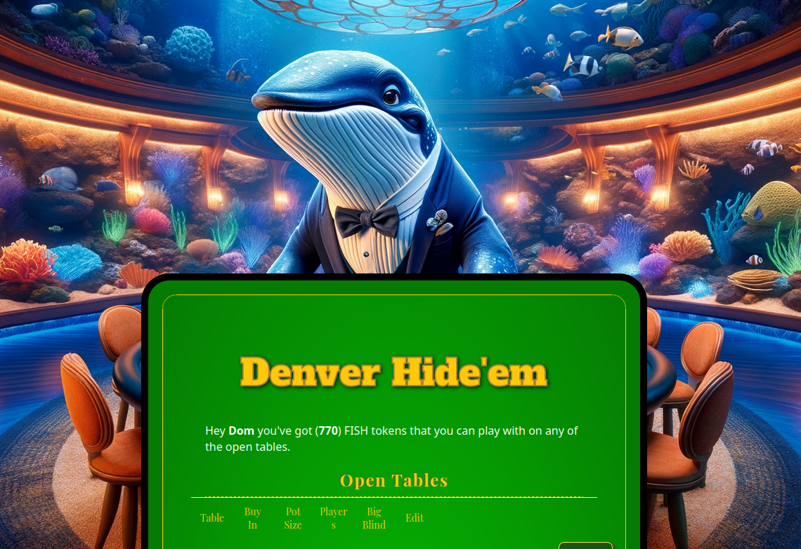

# DEVFOLIO SUBMISSION

## Internal Notes
* Draft In Progress
* Need Blurb
* Cover Image (Optional)
* Up To 5 Pictures (Optional)
* Logo (Optional)
* EthStorage http address
* EthStorage web3 address
* Sapphire Testnet Contract Address
* Needs polish
* XMTP
* EthStorage 

## Actual Submission 
### Project Name
Texas Hide-em

### Tagline
No Frontend, No Backend, Just poker-on-chain

### What Problem it Solves (Markdown Supported)
(Please add your own sound effects when you read this)

Howdy, Partner. "Texas Hide-Em" our brand-new, fully decentralized poker platform for onchain poker enthusiasts.

By leveraging the Oasis Sapphire chain for confidentiality and randomness on the contract side, and hosting the dapp webpage directly on ethstorage, we present a poker dapp that has neither centralized frontend, nor a centralized backend, only a fully decentralized contract. (Whip Sound Effect)

If you have been playing online poker regularly, you can remember the scandals with Absolute Poker or Ultimate Bet, where cheating superusers could view other player's cards. Our solution eradicates the superuser dilemma with confidential computing, keeping all cards provably secret until the showdown. (Good Bad and Ugly Theme Riff)

This is not just poker; it's the future of online gaming, combining privacy, security, and fairness for all players.

Welcome to "Texas Hide-Em," Hide-em high at the mile high city, Denver, Yeeeeeehaw.

### Challenges We Solved (Markdown Supported) (Challenges, Hurdles, or Specific Bugs and how we overcame them)
* Migration between frontend build systems / frontend challenges - Cultivated Flexibility and Powered through
* Source of Secret Onchain Randomness - Used Sapphire RandomBits Precompile
* Partially Revealed Cards - Use a homespun hashing technique with player generated keys and brute force on a tiny preimage space
* Hand selection from 7 cards is too complex onchain - Client does hand selection (js), contract does hand confirmation

### Technologies We Used (List)
#### Bounties
* Oasis Sapphire Chain for Confidentiality 
* Oasis Sapphire Random Precompile
* XMTP for client peer to peer messaging
* Metamask SDK for Wallet Connect 
* EthStorage Hosting 
#### NonBounties
* Solidity, Hardhat, Chai 
* Vue

### Links (To Github, Live Testnet Site)
* https://github.com/ThanksSkeleton/ethdenver_holdem
* https://poker.w3q.w3q-g.w3link.io/
* web3://poker.w3q/

### Video Demo
TODO

### Cover Image ("Glimpse of Your Project To the World")

### Pictures (Up to 5)
TODO 

### Logo
TODO 

### Platforms (Radio Button)
* Web

### Track (Radio Button)
* Privacy

### Select Sponsor Bounties (CheckBox):
EthStorage: Build A Decentralized On-Chain Gaming using Web3 and EthStorage
Linea: Unlesh Your Creativity With Metamask SDK
XMTP: Web3 Notifications Alerts For XMTP Users
Oasis Protocol: Build a Dapp on Oasis Sapphire

### Describe Bounties (Textboxes)

#### Oasis Sapphire 
Our contract is deployed at 0x89E4934E5549d67CE6d5773433CFf3C50FBD65c3 on the oasis sapphire testnet.
We are using Sapphire as our execution environment and our source of confidentiality, and using the oasis Sapphire precompile as our source of onchain randomness.
Our poker contract secretly deals the cards once the last person joins the table, and through the various state transitions of the poker state machine, values are revealed by being moved into public mappings. 
(Personally secret cards aka hole cards are made public in a hashed form which can be de-hashed (brute forced) on client side.)

#### EthStorage
We are deployed our site at w3q-g:0x7B9A7428d780E2b3fC893f9aab8c98A34358F2Fd on the EthStorage Testnet
We have registered web3 URI https://poker.w3q.w3q-g.w3link.io/ and it points to our dapp.

#### Metamask SDK 
We are using the Metamask SDK (web) to provide a wallet connection to our dapp.

#### XMTP
We are using XMTP for players to exchange information in advance of game actions. (Notifications Frame). 